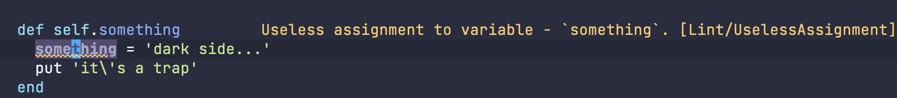

As developers, we are constantly striving to improve our coding practices, maintain code quality, and increase productivity.
In the Ruby ecosystem, two indispensable tools are RuboCop, a popular static code analyzer, and Solargraph, a powerful Ruby language server.
In this article, we will explore the advantages of integrating RuboCop diagnostics into Solargraph, creating a seamless development experience with enhanced code analysis and real-time feedback.

Traditionally, [RuboCop](https://docs.rubocop.org/rubocop/configuration.html) and [Solargraph](https://solargraph.org/) would be invoked as separate processes.
RuboCop for code analysis, violation identification, and enforcing coding conventions.
And Solargraph, for providing an enriched coding experience with code intelligence and development tools.
Running RuboCop and Solargraph as separate processes has certain challenges.
For example, the feedback and diagnostics provided by the tools might not align, leading to confusion with conflicting recommendations for improving code quality.
Additionally, the orchestration of these tools as separate processes requires distinct configurations and IDE plugins; each presenting its concerns.
Most notably, invoking RuboCop as a new process on each request for diagnostics incurs significant overhead, especially for code formatting tasks.
One might traditionally mitigate this by using a long-lived process like [rubocop-daemon](https://github.com/fohte/rubocop-daemon) but it still involves two distinct orchestrators.

By integrating RuboCop within Solargraph, we streamline the development workflow by eliminating the need to separately manage the diagnostic tooling and language server.
This integration offers several benefits:

1. No startup overhead: Since Solargraph is a long-lived process, we can expect instant feedback and formatting suggestions for violations as we type, without the need for repeated process invocation.
1. Reduced tooling complexity: Solargraph orchestrates the invocation and delivery of RuboCop results, reducing the overhead of managing multiple tools and configurations.

Integrating RuboCop into Solargraph enhances the coding experience, providing real-time feedback and analysis, while simplifying the tooling setup and improving productivity.
By leveraging the combined power of RuboCop and Solargraph, developers can focus on writing high-quality code, adhering to coding conventions, and efficiently improving their Ruby projects.

Let's get into it:

**Install RuboCop:**

  Ensure you have RuboCop installed on your system (either globally or via bundler)

**Install Solargraph:**
  
  Ensure you have Solargraph installed on your system (either globally or via bundler)

**Initialize RuboCop Configuration:**

  If you haven't already, generate a .rubocop.yml configuration file for RuboCop in your project directory. You can use the default configuration or customize it according to your coding style preferences.

**Configure Solargraph to Run RuboCop:**

  In your project directory, create a .solargraph.yml configuration file (if it doesn't exist).
  Alternatively, you can run `solargraph config [DIRECTORY]` to initialize boilerplate for you
  Open the .solargraph.yml file and add the following configuration:

  ```yaml
  ...
  reporters:
    - rubocop
  ```
    
**Customize RuboCop Rules:**

  To customize RuboCop rules for your project, modify the .rubocop.yml configuration file.
  Add or adjust rules according to your coding conventions and preferences. Refer to the RuboCop documentation for available configuration options.

**Enable LSP with your Editor:**

  To enable Solargraph to perform linting using RuboCop, you need to configure your text editor or IDE to use Solargraph as the language server.
  This article assumes you have already configured Solargraph to run with a client in your editor of choice. 
  See [here](https://solargraph.org/guides/getting-started) for definitive information on integrating solargraph with your editor.
  Typically, you'll need to install a Solargraph extension or plugin and configure it to use the Solargraph executable.
  Being an Emacs user, I use [lsp-mode's solargraph client](https://emacs-lsp.github.io/lsp-mode/page/lsp-solargraph/). 

**Verify the Integration:**
  Open a Ruby file in your editor and start coding.
  As you write code, Solargraph will perform real-time analysis and display RuboCop diagnostics directly within your editor. This includes identifying and highlighting RuboCop violations, suggesting improvements, and providing documentation for detected issues.



Should you have project-specific RuboCop references defined in the Gemfile you will want to invoke Solargraph via Bundler so that the spawned RuboCop instance operates with the appropriate context. 
Invoking Solargraph via bundler is implemented differently amongst IDE clients. 
Check your IDE's documentation for details. 
If your IDE lacks explicit support, consider implementing an alternate shim for the solargraph command:

```bash
 #!/bin/sh

# help the env use the expected asdf bundle shim
export PATH=~/.asdf/shims:$PATH

# run solargraph via bundle and pass along args
exec bundle exec solargraph $@
```
