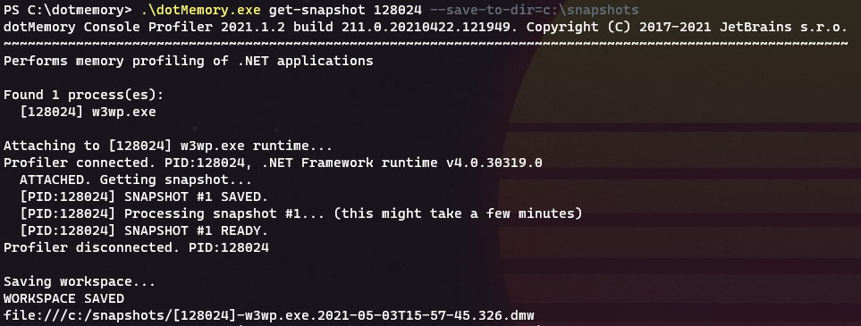

At Mindbody, we made a recent push to containerize and ship our .NET framework applications to an AWS hosted Kubernetes cluster. 
We used [Windows Container Images](https://docs.microsoft.com/en-us/virtualization/windowscontainers/manage-containers/container-base-images) to host our applications.
Once deployed, we noticed that our applications unexpectedly required an excessive amount of memory; more so than the bare-metal predecessor environment.

In such situations, you may find yourself wanting to gain a better picture of the process memory usage on a running pod.
A quick solution is to deploy and run a memory profiler on your windows pod:

1. Ensure your kubectl is configured and that you can list the target pods. Shell into the pod you want to profile:

  `kubectl exec -it somepod-abc-123 -n my-namespace powershell`

2. Investigate the memory allocation per process on the pod:
  `get-process | Group-Object -Property ProcessName | Format-Table Name, @{n='Mem (KB)';e={'{0:N0}' -f (($_.Group|Measure-Object WorkingSet64 -Sum).Sum / 1KB)};a='right'} -AutoSize`

  

3. Download your standalone profiler of choice.
([JetBrains DotMemory](https://www.jetbrains.com/help/dotmemory/Profile_ASP_Web_Site.html#profiling-via-console-tools) is a fantastic and well-featured tool). 
Copy an archive of the profiler to your pod:

  `kubectl cp '.\dotmemory.zip' somepod-abc-123:/PerformanceTools.zip -n my-namespace`
    
4. Extract the archive contents:
    
  `Expand-Archive .\dotmemory.zip`

2. Run the profiler against the high memory process:
    
  `dotmemory.exe get-snapshot 1234 --save-to-dir=c:/memsnapshots`

  

> *Note: you will want to use the `snapshot` or `attach` command instead of `start-iis` to avoid restarting the process. Restarting IIS may cause a whole container restart depending on your setup.*
> *Additionally, if you receive an error indicating a profiler is already attached, you will need to disable that existing profiler and restart IIS. This may entail changing the Dockerfile for the container. For me, the .NET NewRelic agent was previously attached.*

3. Copy the snapshot output back to your local machine and view the results:
    
  `kubectl cp mindbody-api-affiliate-canary-558f5968c4-8s6ch:/snapshots /snapshots -n mindbody-api-affiliate`
