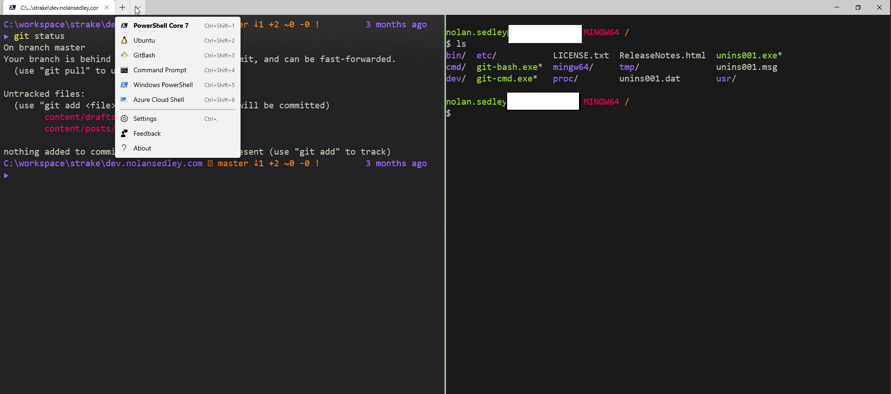
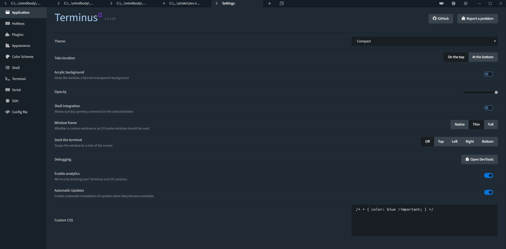
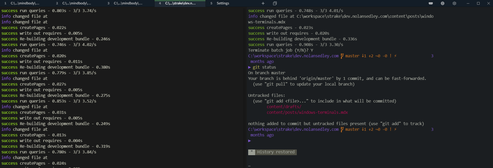
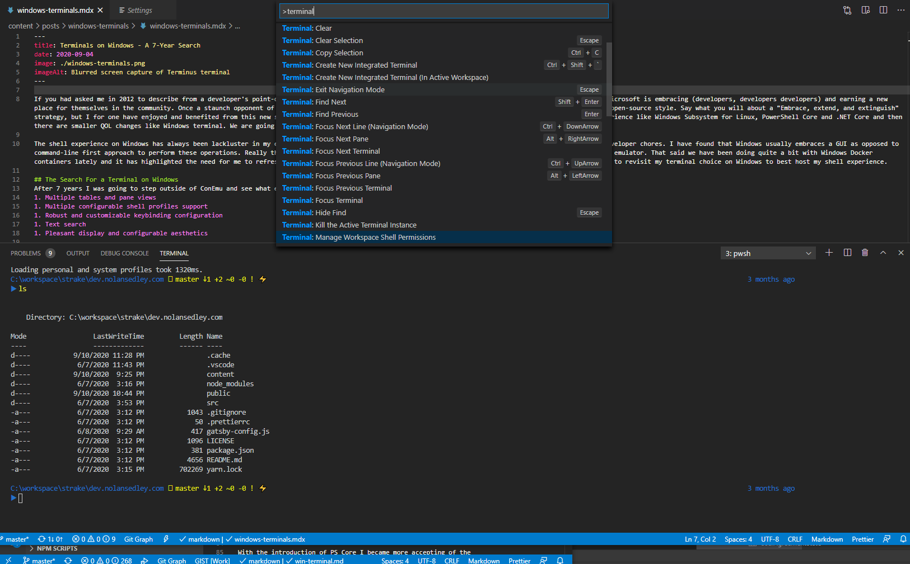
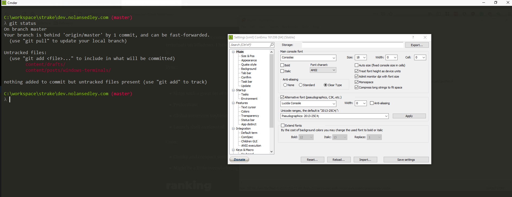

 
If you had asked me in 2012 to describe the Windows deveoper experience in 2020 I would have never used the adjective, appealing. Microsoft is embracing (developers, developers developers) and earning a new place for themselves in the community. Once a staunch opponent of open-source software (more specifically GPL), they seem to have changed their tune and instead opted to embrace an open-source style for several notable projects. Say what you will about the "Embrace, extend, and extinguish" strategy, I have benefited from this change in pace. 

There are big projects that Microsoft has introduced to improve the developer experience such as Windows Subsystem for Linux, PowerShell Core and .NET Core. There are also smaller QOL additions like Windows terminal. We are going to discuss the latter. Really the only shell I was using on consistently on Windows was Git for Windows as a bash emulator. That said we have been doing quite a bit of work with Windows Docker containers lately and it has highlighted the need for me to refresh my PowerShell knowledge and environment. And because I am at times, frivolous, I set out to revisit my terminal choice on Windows to best host my shell experience.

## Desired features
The minimum features I desired in a terminal were:
1. Multiple tables and pane views
1. Multiple configurable shell profiles support​
1. Robust and customizable keybinding configuration​
1. Text search
1. Pleasant display and configurable aesthetics

## Contenders
- [Windows Terminal](#windows-terminal)
- [Terminus](#terminus)
- [VS Code](#vs-code)
- [ConEmu/Cmder](#conemu)
 
### Windows Terminal
It should be no surprise that one of the first stops I made was to [Windows Terminal](https://github.com/microsoft/terminal). I had been following development of this MSFT-built terminal since Build 2019 when I embarrassed myself by walking in front of the live camera rolling an interview at their booth. So, the least I could do is try out the stable release. Here is what I found:
Pros:
+ Delivers on most of the features I desired
+ MSFT-built
+ Minimalist and light
+ Compatibility with VSCode for intellisense on editing the setting json file
+ Command-pallette is an interesting idea

Cons:
- Lacks a global hotkey to restore the terminal window 
- Cannot launch shells as an elevated user (Appears to be a constraint of being a Windows App)      

### Terminus
An incredible terminal I stubbled across is the electron-based application, [Terminus](https://github.com/Eugeny/terminus).

Pros:
+ Popular with a healthy stream of contributors
+ Cross+platform 
+ Feature packed and amazing UX 

+ Tab and history restore
+ Inline tab progress bar

+ Global summons keybinding
+ Launch shell as elevated

Cons:
- I have had rendering issues when using an acrylic background. Toggling it off has fixed it
- Sometimes freezes and never recovers
- Can be a memory hog as with all electron apps
- [Some PSReadLine key handlers are not working](https://github.com/Eugeny/terminus/issues/507)

### VS Code
I realized while investigating this subject that my text editor, Vscode, had an [integrated terminal built in](https://code.visualstudio.com/docs/editor/integrated-terminal). It gets the job done though lacked real-estate:

Pros:
+ Surprisingly good keybinding support
+ Inherits your active color scheme
+ Integrates with VSCode run * command pallette actions

Cons:
- Poor tab view
- Unable to configure multiple shell profiles beyond one per platform
- No global summons keybinding
- Crammed into VSCode window. I like a view dedicated to the shells and with plenty of space
- No vertical pane view (2x2 not possible)

### ConEmu
[ConEmu](https://github.com/Maximus5/ConEmu) and its most common wrapper, [Cmder](https://cmder.net/), are a classic choice for a terminal on Windows. I have been using Cmder for years and been very happy with it.

Pros:
+ Time-tested
+ Ships with a great set of tools while not being too large
+ Performant
+ Global summons keybinding
+ Launch shell as elevated

Cons:
- Clunky and compact settings UI
- Might be a little overwhelming to new-comers  

## Conclusion
You cannot go wrong with any of the terminals listed above; they are strong contenders and I use each gladly. That said here is my current ranking given the mentioned desired feature set:
1. **[Terminus](https://github.com/Eugeny/terminus)** - 
Terminus has a fantastic feature set while not being too overwhelming. Though its performance has been suspect, the fluid pleasant experience presented by this terminal outweighs any negatives. Additionally it is cross-platform and has a healthy open-source community.
1. **[Windows Terminal](https://github.com/microsoft/terminal)** - 
Windows terminal was knocked to number 2 due to some missing features like the ability to launch a shell as an elevated user and summon the terminal globally. That said, it is MSFT-built and relatively new to the scene. I expect it will gain steam and popularity. 
1. **[Cmder](https://cmder.net/)** - 
Cmder is no longer the top terminal I would recommend though still a solid choice. It is a power user's dream though can be overwhelming with the breadth of functionality it encapsulates and the dated compact user experience.
